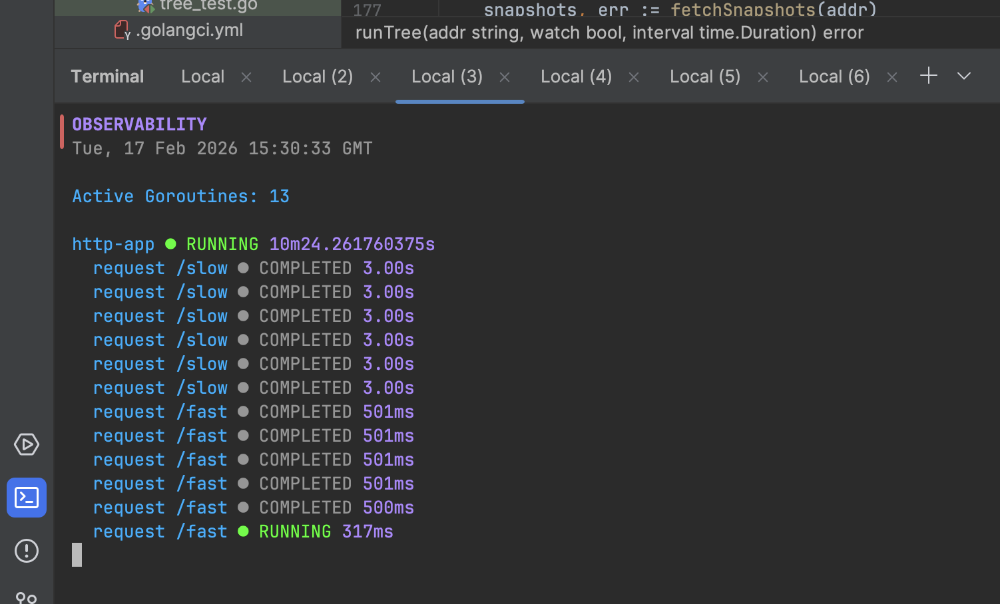

# 🔭 obs — Goroutine Observability for Go

`obs` is a lightweight structured observability toolkit for Go goroutines.

It helps you:

- Track goroutine lifecycle
- Model parent–child task relationships
- Detect slow or leaked tasks
- Visualize concurrency trees in real time
- Inspect state via an HTTP debug endpoint

Designed to be minimal, explicit, and production-friendly.

---

## Features

- Structured goroutine tracking via `context`
- Parent–child relationship modeling
- JSON debug endpoint
- CLI with live watch mode
- Tree visualization
- Slow task detection
- Leak detection (heuristic)
- Neon developer-friendly UI
- Zero heavy dependencies

---

## 📦 Installation

Install the library:

```bash
go get github.com/Daniel-Sogbey/obs
```

Install the CLI:

```bash
go install github.com/Daniel-Sogbey/obs/cmd/obs
```

---

# 🐳 Running with Docker

By default, `obs` listens on port **7070**:

```go
obs.Enable()
obs.Listen(":7070")
```

If your application runs inside a Docker container, you must expose the observability port so the CLI can access it.

---

## Example: Docker Run

If your app listens on:

- `:8080` → application traffic
- `:7070` → obs debug endpoint

Run your container like this:

```bash
docker run \
  -p 8080:8080 \
  -p 7070:7070 \
  myapp
```

Now the `obs` CLI can access:

```
http://localhost:7070/debug/obs
```

And you can run:

```bash
obs tree --watch
```

---

## Example: Docker Compose

```yaml
version: "3.8"

services:
  app:
    build: .
    ports:
      - "8080:8080"
      - "7070:7070"
```

Then start:

```bash
docker compose up
```

---

## Inspecting from the Host

Once port `7070` is exposed, the CLI works normally:

```bash
obs tree
```

Or explicitly:

```bash
obs tree --addr=http://localhost:7070/debug/obs
```

---

## ⚠️ Important

If you do NOT expose port `7070`, the CLI will not be able to connect to the container from your host machine.

In that case, you can:

- Expose the port (recommended for local development), or
- Use `docker exec` to inspect from inside the container.

Example:

```bash
docker exec -it <container-id> sh
obs tree --addr=http://localhost:7070/debug/obs
```

---

## 🔒 Production Note

The `/debug/obs` endpoint should be:

- Disabled in production, or
- Protected behind internal networking, or
- Exposed only in development environments

You control this via:

```go
obs.Enable()
```

If `obs.Enable()` is not called, tracking remains disabled.

---

# 🚀 Quick Start (HTTP Example)

Below is a minimal HTTP server example using `obs`.

## 1️⃣ Enable Observability

```go
package main

import (
	"context"
	"net/http"
	"time"

	"github.com/Daniel-Sogbey/obs/obs"
)

func main() {
	obs.Enable()
	obs.Listen(":7070")

	root := obs.With(context.Background(), "http-app")

	http.HandleFunc("/fast", func(w http.ResponseWriter, r *http.Request) {
		handleRequest(root, "request /fast", 500*time.Millisecond)
		w.Write([]byte("fast response"))
	})

	http.HandleFunc("/slow", func(w http.ResponseWriter, r *http.Request) {
		handleRequest(root, "request /slow", 3*time.Second)
		w.Write([]byte("slow response"))
	})

	http.ListenAndServe(":8080", nil)
}

func handleRequest(parent context.Context, name string, delay time.Duration) {
	ctx := obs.With(parent, name)
	t := obs.FromContext(ctx)
	defer t.Done()

	t.MarkActive()
	time.Sleep(delay)
	t.MarkIdle()
}
```

---

## 2️⃣ Start Server

```bash
go run main.go
```

Visit:

```
http://localhost:8080/fast
http://localhost:8080/slow
```

---

## 3️⃣ Inspect Live Concurrency Tree

```bash
obs tree --watch
```

---

## Example Output

```
OBSERVABILITY
Tue, 17 Feb 2026 13:02:11 GMT

Active Goroutines: 3

http-app ● RUNNING 12.41s
  request /fast ● COMPLETED 501ms
  request /slow ● RUNNING 2.98s
```
---
   
---

# Debug Endpoint

By default:

```
GET http://localhost:7070/debug/obs
```

Returns:

```json
[
  {
    "id": 1,
    "name": "http-app",
    "parent_id": 0,
    "state": "running",
    "duration": 12412500000
  }
]
```

---

# 🛠 CLI Commands

### Tree View

```bash
obs tree
```

### Live Tree

```bash
obs tree --watch
```

Optional refresh interval:

```bash
obs tree --watch --interval=1s
```

---

### Flat List

```bash
obs list
```

---

### Slow Goroutines

```bash
obs slow --threshold=2s
```

---

### Leak Detection (Heuristic)

```bash
obs leaks
```

---

# How It Works

- `obs.With()` creates a logical tracker
- Trackers are stored in a concurrent registry
- Parent–child relationships are derived from context propagation
- `Snapshot()` creates immutable state views
- CLI consumes snapshot JSON and builds a tree
- Watch mode re-renders the view periodically

No runtime hacks. No goroutine ID introspection.

This models structured concurrency explicitly.

---

# 📁 Project Structure

```
cmd/obs/       → CLI tool
obs/           → Library
examples/      → Demo usage
```

---

#  What This Is Not

- Not a Go scheduler inspector
- Not a `pprof` replacement
- Not runtime-level goroutine introspection

It tracks logical concurrent tasks you instrument.

---

#  Design Philosophy

- Explicit instrumentation
- Context-driven structure
- Minimal overhead
- Snapshot-based observability
- CLI-first experience
- Developer-friendly output

---

# 🤝 Contributing

PRs welcome.

If you add features, keep the core principles:

- No heavy dependencies
- No runtime magic
- Clean separation of concerns
- Production-safe behavior

---

Built with ❤️ for developers who want to *see* their concurrency.